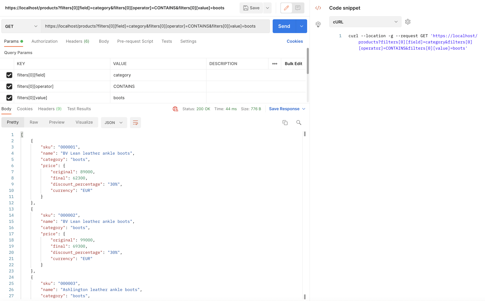

## The challenge

We want you to implement a REST API endpoint that given a list of products, applies some discounts to them and can be filtered.

You are free to choose whatever language and tools you are most comfortable with. Please add instructions on how to run it and publish it in Github.

What we expect

* ✅ Code structure/architecture must fit this use case, as simple or as complex needed to complete what is asked for.
* ✅ Tests are a must. Code must be testable without requiring networking or the filesystem. Tests should be runnable with 1 command.
* ✅ The project must be runnable with 1 simple command from any machine. (with Doker)
* ✅ Explanations on decisions taken (at the end of this file)
---

## Given this list of products:

```
[
  {
    "sku": "000001",
    "name": "BV Lean leather ankle boots",
    "category": "boots",
    "price": 89000
  },
  {
    "sku": "000002",
    "name": "BV Lean leather ankle boots",
    "category": "boots",
    "price": 99000
  },
  {
    "sku": "000003",
    "name": "Ashlington leather ankle boots",
    "category": "boots",
    "price": 71000
  },
  {
    "sku": "000004",
    "name": "Naima embellished suede sandals",
    "category": "sandals",
    "price": 79500
  },
  {
    "sku": "000005",
    "name": "Nathane leather sneakers",
    "category": "sneakers",
    "price": 59000
  }
]
```

You must take into account that this list could grow to have 20.000 products. The prices are integers for example, 100.00€ would be 10000.

You can store the products as you see fit (json file, in memory, rdbms of choice)

## Given that:

* Products in the boots category have a 30% discount.
* The product with sku = 000003 has a 15% discount.
* When multiple discounts collide, the biggest discount must be applied.


Provide a single endpoint
---

**GET /products**

* ✅ Can be filtered by category as a query string parameter
* ✅ (optional) Can be filtered by priceLessThan as a query string parameter, this filter applies before
discounts are applied and will show products with prices lesser than or equal the value provided.
* ✅ Returns a list of Product with the given discounts applied when necessary
* ✅ Must return at most 5 elements. (The order does not matter)

**Product model**

* ✅ Price.currency is always EUR
* ✅ When a product does not have a discount, price.final and price.original should be the same number
and discount_percentage should be null.
* ✅ When a product has a discount price.original is the original price, price.final is the amount with the
discount applied and discount_percentage represents the applied discount with the % sign.


# Example product output:
```
# with a discount of 30% applied
[
    {
        "sku": "000001",
        "name": "BV Lean leather ankle boots",
        "category": "boots",
        "price": {
            "original": 89000,
            "final": 62300,
            "discount_percentage": "30%",
            "currency": "EUR"
        }
    }
]

# without a discount
[
    {
        "sku": "000001",
        "name": "BV Lean leather ankle boots",
        "category": "boots",
        "price": {
            "original": 89000,
            "final": 89000,
            "discount_percentage": null,
            "currency": "EUR"
        }
    }
]
```


How to validate the Test?
--

By PHP
---

```
#install composer
composer install

#run the test
php vendor/bin/phpunit --testdox

```

By Makefile and Docker (the easiest step)
---

```
#to run all step into one step 
make run

#to run only the tests
make tests-unit

```

With Docker Compose (the hardest step)
---

```
#to create the container of php
docker-compose up -d php

#install composer
docker-compose exec php composer install

#run the test
docker-compose exec php vendor/bin/phpunit --testdox

#access to the container
docker-compose exec php bash 

```

Make requests to the endpoint [/products](https://localhost/products)
---

**TEST WITH cURL**
```
# search without filters
curl --location -g -k --request GET 'http://localhost/products'

# search by category
curl --location -g -k --request GET 'http://localhost/products?filters[0][field]=category&filters[0][operator]=CONTAINS&filters[0][value]=boots'

# search by sku
curl --location -g -k --request GET 'http://localhost/products?filters[0][field]=sku&filters[0][operator]=CONTAINS&filters[0][value]=00003'
```

**TEST WITH POSTMAN**




```
RESULTS

# search without filters
[
    {
        "sku": "000001",
        "name": "BV Lean leather ankle boots",
        "category": "boots",
        "price": {
            "original": 89000,
            "final": 62300,
            "discount_percentage": "30%",
            "currency": "EUR"
        }
    },
    {
        "sku": "000002",
        "name": "BV Lean leather ankle boots",
        "category": "boots",
        "price": {
            "original": 99000,
            "final": 69300,
            "discount_percentage": "30%",
            "currency": "EUR"
        }
    },
    {
        "sku": "000003",
        "name": "Ashlington leather ankle boots",
        "category": "boots",
        "price": {
            "original": 71000,
            "final": 49700,
            "discount_percentage": "30%",
            "currency": "EUR"
        }
    },
    {
        "sku": "000004",
        "name": "Naima embellished suede sandals",
        "category": "sandals",
        "price": {
            "original": 79500,
            "final": 79500,
            "discount_percentage": null,
            "currency": "EUR"
        }
    },
    {
        "sku": "000005",
        "name": "Nathane leather sneakers",
        "category": "sneakers",
        "price": {
            "original": 59000,
            "final": 59000,
            "discount_percentage": null,
            "currency": "EUR"
        }
    }
]


# search by category
[
    {
        "sku": "000001",
        "name": "BV Lean leather ankle boots",
        "category": "boots",
        "price": {
            "original": 89000,
            "final": 62300,
            "discount_percentage": "30%",
            "currency": "EUR"
        }
    },
    {
        "sku": "000002",
        "name": "BV Lean leather ankle boots",
        "category": "boots",
        "price": {
            "original": 99000,
            "final": 69300,
            "discount_percentage": "30%",
            "currency": "EUR"
        }
    },
    {
        "sku": "000003",
        "name": "Ashlington leather ankle boots",
        "category": "boots",
        "price": {
            "original": 71000,
            "final": 49700,
            "discount_percentage": "30%",
            "currency": "EUR"
        }
    }
]


# search by sku
[
    {
        "sku": "000003",
        "name": "Ashlington leather ankle boots",
        "category": "boots",
        "price": {
            "original": 71000,
            "final": 49700,
            "discount_percentage": "30%",
            "currency": "EUR"
        }
    }
]
```


Assumptions
--
* Assuming docker compose is used. [How to install it?](https://docs.docker.com/get-docker/)
* Assuming Makerfile is used. [How to install it?](https://linuxhint.com/install-make-ubuntu/)
* Assuming port 80 is not being used on localhost


### 🔥 Application execution

1. Install all the dependencies and bring up the project with Docker executing: `make run`
2. Then you'll have 1 apps available:
    1. [Kata](/products): http://localhost/products

### ✅ Tests execution

1. Install the dependencies if you haven't done it previously: `make vendor`
2. Execute PHPUnit and Behat tests: `make tests-unit`

## 👩‍💻 Project explanation

This project is using the framework Symfony 6

### ⛱️ Bounded Contexts

* [Common](src/Common): Place to look in if you wanna see some code 🙂.
* [Discount](src/Discount): Here you'll find the use cases needed by the Product endpoint in order to find products.

### 🎯 Hexagonal Architecture

This repository follows the Hexagonal Architecture pattern.
With this, we can see that the current structure of a Bounded Context is:

```scala
$ tree -L 5 src
src
├── Common  // Shared Kernel: Common infrastructure and domain shared between the different Bounded Contexts
│   ├── Domain
│   │   ├── Assert.php
│   │   ├── Collection.php
│   │   ├── Contracts
│   │   │   ├── Currency.php
│   │   │   ├── CurrencyValueObject.php
│   │   │   ├── Entity.php
│   │   │   ├── Enum.php
│   │   │   ├── Equatable.php
│   │   │   ├── IntValueObject.php
│   │   │   ├── Price.php
│   │   │   ├── PriceValueObject.php
│   │   │   ├── StringValueObject.php
│   │   │   └── ValueObject.php
│   │   ├── Criteria  // Criteria pattern
│   │   │   ├── Criteria.php
│   │   │   ├── CriteriaConverter.php
│   │   │   ├── Filter.php
│   │   │   ├── FilterField.php
│   │   │   ├── FilterOperator.php
│   │   │   ├── FilterValue.php
│   │   │   ├── Filters.php
│   │   │   ├── Order.php
│   │   │   ├── OrderBy.php
│   │   │   └── OrderType.php
│   │   ├── Model  // Common object values
│   │   │   ├── Currency.php
│   │   │   ├── Price.php
│   │   │   └── Sku.php
│   │   └── Transformable.php
│   └── Infrastructure
│       └── Bus
│           ├── Bus.php
│           └── BusComponent.php
├── Discount  // Discount subdomain / Bounded Context: Features related to the products
│   ├── Application  // Inside the application layer all is structured by actions
│   │   ├── ProductResponse.php
│   │   ├── ProductsResponse.php
│   │   └── SearchByCriteria  
│   │       ├── GetProductList.php
│   │       ├── GetProductListHandler.php
│   │       └── ProductSearcher.php
│   ├── Domain
│   │   ├── Discount
│   │   │   ├── Discount.php
│   │   │   ├── Discounter.php  //Service to apply discount by requirements
│   │   │   └── Specification   //Specification pattern to apply one or multiple discount to product
│   │   │       ├── CategorySpecification.php
│   │   │       ├── OrSpecification.php
│   │   │       ├── SkuSpecification.php
│   │   │       ├── Specification.php
│   │   │       └── SpecificationCollection.php
│   │   └── Product
│   │       ├── Product.php  // The Aggregate of the Module
│   │       ├── ProductCategory.php
│   │       ├── ProductDiscounter.php
│   │       ├── ProductName.php
│   │       └── ProductRepository.php  // Repository interface
│   └── Infrastructure
│       ├── Persistence
│       │   └── InMemory
│       │       ├── InMemoryCriteria.php
│       │       ├── InMemoryCriteriaConverter.php
│       │       ├── InMemoryProductRepository.php
│       │       ├── ReadFile.php
│       │       └── products.json  // products stored in a json file
│       └── Ui
│           └── Rest
│               └── SearchProductsController.php // Port / endpoint to search products
└── Kernel.php

```

#### Specification pattern
I use the Specification pattern to apply the correct discount to one product by its requirements.

Builds a clear specification of business rules, where objects can be checked against. 
The composite specification class has one method called isSatisfiedBy that returns either true or false
depending on whether the given object satisfies the specification.

You can see an example [here](src/Discount/Domain/Discount/Specification/Specification.php)
and its implementation [here](src/Discount/Domain/Discount/Specification/CategorySpecification.php)
also here [here](src/Discount/Domain/Discount/Specification/SkuSpecification.php)


#### Repository pattern
The repository try to be as simple as possible, it's only containing 2 methods `save` and `findAll` (save method will be done on the next version).
If the endpoint search need some query with more filters I use the `Criteria` pattern. 
So I add a `search` method.

You can see an example [here](src/Discount/Domain/Product/ProductRepository.php)
and its implementation [here](src/Discount/Infrastructure/Persistence/InMemory/InMemoryProductRepository.php).

**Note**: On this time, I wanted more dependency from database and its configuration, 
for this reason I built this respository `In Memory` with all the products stored in a `products.json` file.

You can see the file [here](src/Discount/Infrastructure/Persistence/InMemory/products.json)

